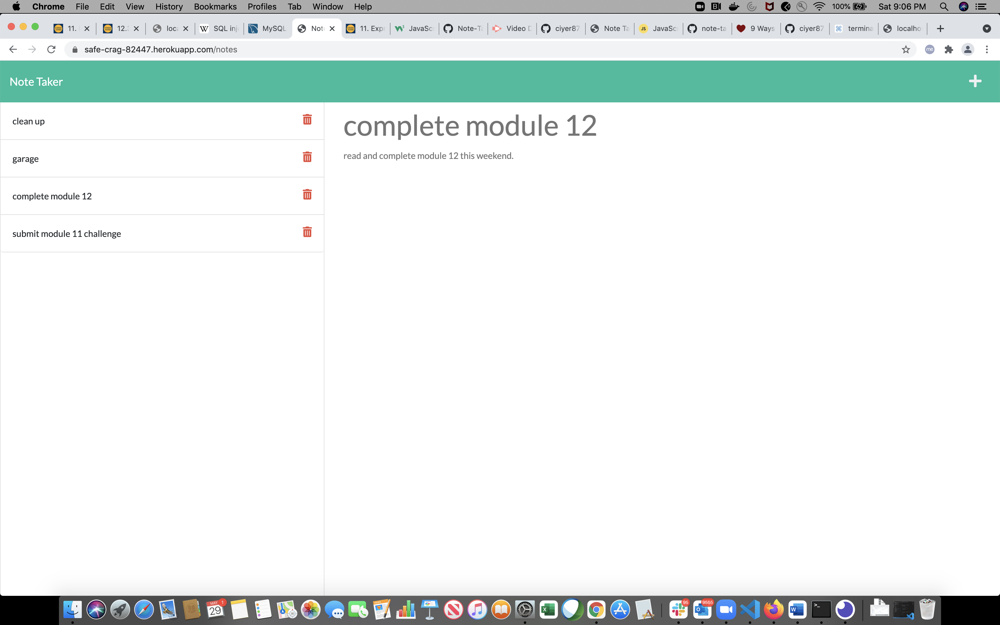

# Note Taker

This is an Express.js application application that can be used to write, save and retrieve notes from a JSON file.

# Installation

Clone the repository from GitHub and open using Visual Studio Code.

# Usage

Deployed site: https://safe-crag-82447.herokuapp.com/

# Screenshots

* Notes

* Note details

# Questions

[Contact me](chitra.iyer00@gmail.com)

[GitHub](https://github.com/ciyer87)
